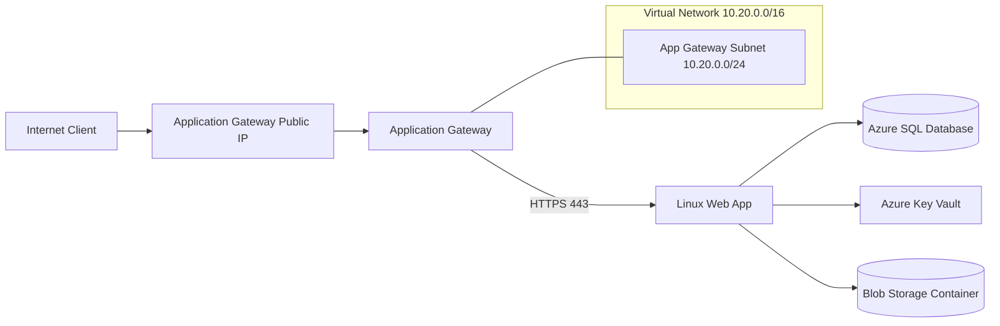

# Quantum Shield Infrastructure Documentation

This document describes the Terraform infrastructure defined in this folder and how the components interact.

## Scope

Terraform in this folder provisions the following Azure resources:

- Resource Group
- Virtual Network + dedicated Application Gateway subnet
- Public IP for Application Gateway
- Application Gateway (Standard_v2)
- App Service Plan (Linux)
- Linux Web App (backend)
- Static-content Linux Web App (same App Service Plan)
- Key Vault (RBAC enabled)
- Azure SQL Server + Azure SQL Database
- Storage Account + private Blob container

## High-Level Architecture



## Resource Naming Strategy

Names are built from `prefix` and, for globally-unique services, a generated random suffix:

- `resource_group_name` input variable (for example, `rg-teamorange`)
- `vnet-${prefix}`
- `snet-appgw`
- `pip-${prefix}-appgw`
- `agw-${prefix}`
- `asp-${prefix}`
- `app-${prefix}` (normalized and trimmed)
- `static-${prefix}` (normalized and trimmed)
- `kv-${prefix}-${random_suffix}`
- `sql-${prefix}-${random_suffix}`
- `st${prefix}${random_suffix}` (normalized and trimmed)

## Network and Traffic Flow

1. Client traffic reaches Application Gateway through a Standard Public IP.
2. Application Gateway listener accepts HTTP on port 80.
3. Routing rule forwards to backend pool containing the Web App default hostname.
4. Backend connection from Application Gateway to Web App uses HTTPS on port 443.
5. Health probe checks `/` over HTTPS and accepts status `200-399`.

## Web App Inbound Security (Gateway-Only Pattern)

The Web App is restricted to accept inbound requests only from the Application Gateway subnet:

- `ip_restriction_default_action = "Deny"`
- `scm_ip_restriction_default_action = "Deny"`
- Explicit allow rule on `virtual_network_subnet_id = azurerm_subnet.app_gateway.id`

Subnet configuration enables `Microsoft.Web` service endpoint so VNet-based App Service access restriction can be applied.

Result: direct public access to the Web App endpoint is denied; requests are expected to come through Application Gateway.

## Data and Platform Services

### Key Vault

- SKU: Standard
- RBAC authorization enabled
- Soft delete retention: 7 days
- Purge protection controlled by variable
- Public network access currently enabled

### Azure SQL

- SQL Server version 12.0
- Minimum TLS 1.2
- SQL admin credentials provided through Terraform variables
- Optional firewall rule `0.0.0.0` (Allow Azure Services) controlled by variable
- Database SKU and max size are configurable

### Blob Storage

- Storage Account tier: Standard
- Replication: configurable (`LRS` default)
- Minimum TLS 1.2
- Nested public items disabled
- Blob container access type: `private`

## Terraform Inputs

Key inputs from `variables.tf`:

- `prefix`
- `location`
- `azure_subscription_id`
- `azure_tenant_id`
- `azure_client_id`
- `azure_client_secret`
- `app_service_sku_name`
- `app_service_runtime_stack`
- `key_vault_purge_protection_enabled`
- `sql_administrator_login`
- `sql_administrator_password` (sensitive, required)
- `sql_database_name`
- `sql_database_sku_name`
- `sql_database_max_size_gb`
- `sql_allow_azure_services`
- `storage_replication_type`
- `blob_container_name`
- `tags`

## Terraform Outputs

Exposed outputs from `outputs.tf`:

- `resource_group_name`
- `application_gateway_public_ip`
- `application_gateway_name`
- `backend_web_app_name`
- `backend_web_app_hostname`
- `static_content_app_name`
- `static_content_app_hostname`
- `key_vault_name`
- `key_vault_uri`
- `sql_server_fqdn`
- `sql_database_name`
- `storage_account_name`
- `blob_container_name`

## Deployment

From this folder:

```bash
copy terraform.tfvars.example terraform.tfvars
# set azure_subscription_id, azure_tenant_id, azure_client_id, azure_client_secret, and sql_administrator_password
terraform init
terraform plan
terraform apply
```

## Operational Notes

- Keep `azure_client_secret` and `sql_administrator_password` out of source control.
- The current frontend listener is HTTP only. For production, prefer HTTPS listener and certificate on Application Gateway.
- Public network access is still enabled on Key Vault, SQL Server, and Storage Account; consider private endpoints for stricter isolation.
- With SCM restriction set to Deny, deployment paths that use Kudu/SCM may require dedicated allow rules.

## Source Files

- `main.tf`: core resource definitions
- `variables.tf`: configurable inputs
- `outputs.tf`: exported deployment values
- `versions.tf`: provider and Terraform version constraints
- `terraform.tfvars.example`: sample environment configuration
